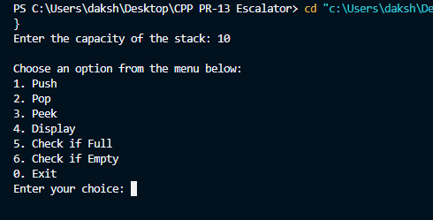
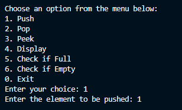
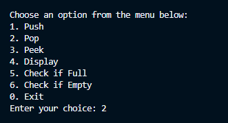
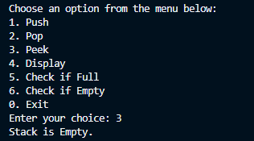
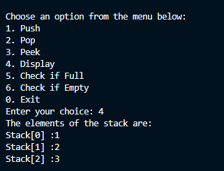
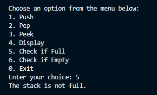
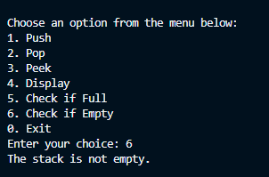
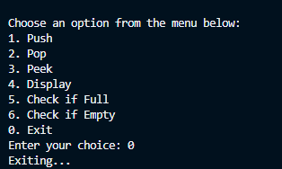

# Stack Implementation in C++

This project demonstrates a simple implementation of a stack data structure in C++ using a dynamic array. The program provides a menu-driven interface for users to interact with the stack.

## Features

- **Push**: Add an element to the top of the stack.
- **Pop**: Remove the top element from the stack.
- **Peek**: View the top element of the stack without removing it.
- **Display**: Display all elements in the stack.
- **Check if Full**: Verify if the stack is full.
- **Check if Empty**: Verify if the stack is empty.

## Output

## 0.Menu

## 1.Push

## 2.Pop

## 3.Peek/Top

## 4.Display

## 5.Check If Full

## 6.Check If Empty

## 7.Exit

